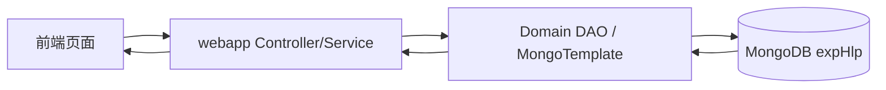
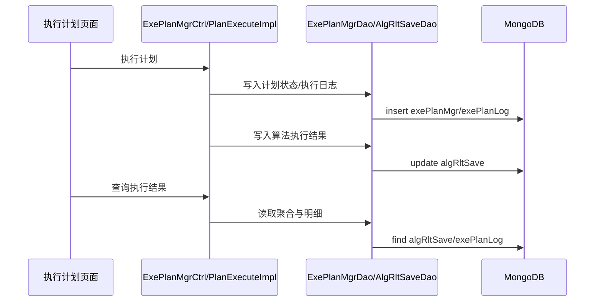

# MongoDB 功能与开发说明（长期维护）

> 文档定位：本文件是本项目 MongoDB 相关能力的唯一开发说明，面向“未接触过 MongoDB 的开发者”和“首次接手本项目的维护者”。
> 适用范围：数据存储模型、集合职责、ID 兼容、索引策略、运行排障、版本演进。
> 维护要求：凡涉及 Mongo 配置、集合结构、DAO 查询语义、删除一致性、索引与初始化脚本改动，必须同步更新本文档。
> 关联文档：
> - 运维操作：`docs/dev/维护手册.md`
> - 配置键基线：`docs/dev/配置清单.md`
> - 错误码定义：`docs/dev/错误码映射.md`
> - 迭代轨迹：`docs/dev/开发日志.md`

---

## 1. 给零基础开发者的 MongoDB 快速理解

### 1.1 MongoDB 在本项目中承担什么职责
- MongoDB 是平台的主业务数据库，存放用户、问题实例、算法库、执行计划、执行日志、执行结果和通知任务。
- 项目后端以 `MongoTemplate` 为主访问方式，不依赖 JPA 实体自动建表。
- 大多数页面数据（问题实例管理、算法库管理、执行计划管理、平台管理）都直接来自 Mongo 集合查询结果。

### 1.2 为什么这里选择 MongoDB
- 计划执行日志、算法结果明细、通知记录都属于“结构相对灵活、字段可能扩展”的文档数据，Mongo 更适合迭代演进。
- 多语言算法接入（Java/Python）会带来不同元数据，文档模型更容易做向后兼容。
- 与当前项目历史数据兼容策略一致（存在 string/ObjectId 混存场景，需要按文档数据库方式修复）。

### 1.3 本项目中的核心概念
- `collection`：集合，对应业务域（如 `exePlanMgr`、`algLibMgr`）。
- `_id`：主键，历史数据存在 string 与 ObjectId 混存。
- `index`：查询与唯一性约束（通知 outbox 有业务唯一索引）。
- `TTL index`：按时间自动清理历史数据（用于通知记录保留期）。

---

## 2. 职责边界（避免误用）

### 2.1 MongoDB 负责
- 持久化业务主数据与运行数据。
- 支撑计划状态修复、删除一致性判定、通知重试队列状态转换。
- 提供跨模块共享数据读取（如执行结果汇总用于邮件内容）。

### 2.2 MongoDB 不负责
- 不做服务发现（由 Nacos 负责）。
- 不做消息路由（由 RabbitMQ 负责，当前主链路通知使用 DB Outbox）。
- 不做算法计算（由各算法服务容器负责）。

---

## 3. 部署拓扑与初始化

### 3.1 容器与持久化卷
- 编排文件：`docker/docker-compose.yml`
- Mongo 容器：`c_exphlp_mongo`
- 持久化卷：`mongo-data:/data/db`
- 默认端口映射：`27017:27017`

### 3.2 初始化脚本与初始数据
- 初始化脚本：`docker/mongo/mongo-init.js`
- 默认数据库：`expHlp`
- 初始化用户：`user / 123456`（可被环境变量覆盖）
- 初始化集合（脚本直接创建）：
  - `probInstMgr`
  - `algLibMgr`
  - `exePlanMgr`
  - `userMgr`
  - `algRltSave`
- 管理员初始化：读取 `APP_INIT_ADMIN_*` 环境变量，若用户不存在则写入 `userMgr`。

### 3.3 运行拓扑关系图（文字版）


---

## 4. 配置来源与覆盖规则

### 4.1 单一真实来源
- 运行时以 `docker/.env` 注入为准。
- `application.yml` 仅保留默认值。
- `docker-compose.yml` 负责把环境变量注入容器。

### 4.2 关键配置键（当前版本）
- `MONGODB_URI`
- `APP_MONGO_USER`
- `APP_MONGO_PASSWORD`
- `APP_MONGO_DB`
- `MONGO_PORT`
- `MONGO_ROOT_USER`
- `MONGO_ROOT_PASSWORD`
- `APP_INIT_ADMIN_USER`
- `APP_INIT_ADMIN_PASSWORD`
- `APP_INIT_ADMIN_EMAIL`
- `APP_INIT_ADMIN_WECHAT`

说明：
- `webapp` 中 `spring.data.mongodb.uri` 由 `MONGODB_URI` 覆盖。
- 配置变更必须同步 `docs/dev/配置清单.md`。

---

## 5. 集合与模块映射（按真实代码）

| 集合名 | 主要写入模块 | 主要读取模块 | 说明 |
| --- | --- | --- | --- |
| `probInstMgr` | `ProbInstDao` | 问题实例管理、计划执行 | 问题实例主数据 |
| `algLibMgr` | `AlgLibMgrDao` | 算法库、执行前检查 | 算法定义、服务名、运行时类型 |
| `exePlanMgr` | `ExePlanMgrDao` | 执行计划管理 | 计划主体与状态字段 |
| `exePlanLog` | `ExePlanMgrDao` | 执行日志弹窗 | 执行阶段日志（PLAN_START/ALG_CALL/PLAN_DONE 等） |
| `algRltSave` | `AlgRltSaveDao` | 执行结果弹窗、邮件汇总 | 指标明细与聚合结果 |
| `userMgr` | `UserInfoDao` | 登录鉴权、平台管理 | 用户、权限、个人信息 |
| `notificationOutbox` | `NotificationDao` | 通知记录页面、调度器 | 通知任务状态机（PENDING/SENDING/SENT/FAILED） |
| `userNotifyProfile` | `NotificationDao` | 个人通知设置 | 用户通知偏好 |
| `algBuildTask` | `AlgBuildTaskServiceImpl` | 算法“源码上传与构建”弹窗 | 上传任务、构建日志路径、容器信息 |

补充：
- `notificationOutbox`、`userNotifyProfile`、`algBuildTask` 不在 `mongo-init.js` 里显式创建，按应用运行时惰性创建。

---

## 6. 关键代码入口（可直接定位）

| 功能 | 文件路径 | 关键点 |
| --- | --- | --- |
| 问题实例 DAO | `exphlp/domain/probInstMgr/src/main/java/fjnu/edu/probInstMgr/dao/ProbInstDao.java` | `probInstMgr` 集合增删改查 |
| 算法库 DAO | `exphlp/domain/algLibMgr/src/main/java/fjnu/edu/alglibmgr/dao/AlgLibMgrDao.java` | `algLibMgr` 集合与删除一致性 |
| 执行计划 DAO | `exphlp/domain/exePlanMgr/src/main/java/fjnu/edu/exePlanMgr/dao/ExePlanMgrDao.java` | `exePlanMgr/exePlanLog` 查询与状态修复 |
| 执行结果 DAO | `exphlp/domain/algRltSave/src/main/java/fjnu/edu/dao/AlgRltSaveDao.java` | `algRltSave` 查询与回写 |
| 用户 DAO | `exphlp/domain/platMgr/src/main/java/fjnu/edu/platmgr/dao/UserInfoDao.java` | `userMgr` 用户管理 |
| 通知 DAO | `exphlp/api/clientApi/src/main/java/fjnu/edu/notify/dao/NotificationDao.java` | outbox 索引、claim/retry/final 状态 |
| 构建任务存储 | `exphlp/api/webApp/src/main/java/fjnu/edu/algruntime/service/impl/AlgBuildTaskServiceImpl.java` | `algBuildTask` 任务持久化 |
| ID 兼容工具 | `exphlp/foundation/src/main/java/fjnu/edu/common/utils/mongo/MongoIdCompatSupport.java` | string/ObjectId 兼容查询与删除 |

---

## 7. 数据流（与用户动作对应）

### 7.1 计划执行与结果入库链路


### 7.2 通知 outbox 异步分发链路（当前生产路径）
```mermaid
flowchart TD
  A[计划结束] --> B[NotificationServiceImpl 入队]
  B --> C[(notificationOutbox)]
  D[@Scheduled dispatchPending] --> C
  D --> E[MailProvider 发送]
  E --> F{发送结果}
  F -- 成功 --> G[markSent]
  F -- 失败可重试 --> H[markRetry]
  F -- 失败不可重试 --> I[markFinalFailed]
  G --> C
  H --> C
  I --> C
```

---

## 8. 一致性与兼容机制（维护重点）

### 8.1 ID 兼容（string/ObjectId 混存）
- 问题来源：历史阶段 `_id` 类型不统一，导致“记录存在但查不到/删不掉”。
- 机制：`MongoIdCompatSupport.buildStringOrObjectIdCriteria(...)` 在关键删除/查询路径双判定。
- 影响：减少“前端提示删除成功但列表仍在”的一致性问题。

### 8.2 删除语义统一（跨前后端）
- 关键语义：
  - `deletedCount > 0`：删除成功
  - `noop=true, verified=true`：已不存在（幂等成功）
  - `noop=true, verified=false`：不可确认，视为失败
  - `blocked=true`：存在执行计划引用，禁止删
- 目标：让前端提示与后端真实数据状态一致。

### 8.3 执行状态兜底修复
- 执行计划列表查询时，若状态仍“执行中”，会结合 `exePlanLog` 终态日志修复为“正常结束/异常结束”。
- 目的：修复中断场景下的状态悬挂，避免用户误判。

---

## 9. 排障手册（Mongo 视角）

### 9.1 快速检查
```powershell
docker ps --format "table {{.Names}}\t{{.Status}}\t{{.Ports}}"
docker exec c_exphlp_mongo mongosh --eval "db.adminCommand('ping')"
```

### 9.2 查看数据库与集合
```powershell
docker exec c_exphlp_mongo mongosh expHlp --eval "show collections"
```

### 9.3 检查计划是否真实存在
```powershell
docker exec c_exphlp_mongo mongosh expHlp --eval "db.exePlanMgr.find({planName:/demo-plan/i},{planId:1,planName:1,exeState:1}).pretty()"
```

### 9.4 检查通知任务状态
```powershell
docker exec c_exphlp_mongo mongosh expHlp --eval "db.notificationOutbox.find({}, {planId:1,status:1,lastErrorCode:1,createdAt:1}).sort({createdAt:-1}).limit(20).pretty()"
```

---

## 10. 开发与变更准则（必须遵守）

1. 变更集合字段时遵循“先加后用”：
   - 先新增可空字段；
   - 回填历史数据；
   - 最后再增加校验约束（如需要）。
2. 不做高风险破坏性动作：
   - 禁止直接 drop 旧集合；
   - 禁止无迁移计划的 rename。
3. 所有 Mongo 相关改动必须同步更新：
   - `docs/dev/配置清单.md`（若涉及配置）
   - `docs/dev/错误码映射.md`（若涉及错误语义）
   - `docs/dev/开发日志.md`（记录验证命令与结果）
4. 删除一致性问题排查优先级：
   - 先查数据库真实记录；
   - 再查后端删除返回语义；
   - 最后查前端列表刷新逻辑。

