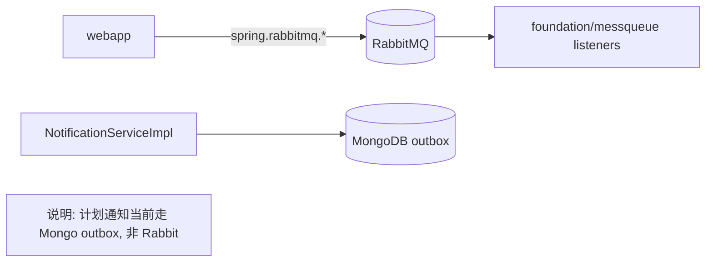

# RabbitMQ 功能与开发说明（长期维护）

> 文档定位：本文件是本项目 RabbitMQ 相关能力的唯一开发说明，面向“未接触过 RabbitMQ 的开发者”和“首次接手本项目的维护者”。
> 适用范围：RabbitMQ 在本项目中的职责定位、配置来源、代码入口、运行排障、后续扩展约束。
> 维护要求：凡涉及 RabbitMQ 配置、交换机/队列绑定、监听器、消息发送链路改动，必须同步更新本文档。
> 关联文档：
> - 运维操作：`docs/dev/维护手册.md`
> - 配置键基线：`docs/dev/配置清单.md`
> - 错误码定义：`docs/dev/错误码映射.md`
> - 迭代轨迹：`docs/dev/开发日志.md`

---

## 1. 给零基础开发者的 RabbitMQ 快速理解

### 1.1 RabbitMQ 在本项目里是什么角色
- RabbitMQ 是消息中间件，负责“异步投递”和“解耦处理”。
- 在本项目当前版本中，RabbitMQ 仍作为基础容器能力保留，部分监听器与交换机配置仍在代码中可见。
- 当前主业务链路（计划执行通知）采用“MongoDB Outbox + 定时调度发送”，并未依赖 RabbitMQ 做通知投递。

### 1.2 为什么不是“当前不用就删掉 RabbitMQ”
- 历史代码中有成套 Rabbit 配置与监听器，贸然移除会引入未知回归。
- 后续 Python 端扩展（例如长耗时任务解耦、事件广播）可能复用 RabbitMQ。
- 现阶段采用“保留基础设施 + 文档化边界 + 渐进收敛”策略，降低改造风险。

### 1.3 核心概念（最小集合）
- `Exchange`：交换机，按路由规则分发消息。
- `Queue`：队列，消息落地缓存。
- `RoutingKey`：路由键，决定消息进入哪个队列。
- `Listener`：消费者监听器，处理队列消息。

---

## 2. 职责边界（当前版本）

### 2.1 RabbitMQ 当前负责
- 提供标准消息中间件运行环境（容器与管理台）。
- 承载 `foundation/messqueue/rabbitmq` 下历史队列/监听器配置的运行前提。
- 为后续异步事件扩展预留可复用通道。

### 2.2 RabbitMQ 当前不负责
- 不负责 Nacos 服务注册与发现。
- 不负责执行计划状态存储。
- 不负责当前邮件通知主链路（当前为 DB Outbox + `@Scheduled` 分发）。

---

## 3. 部署拓扑与端口

### 3.1 容器信息
- 编排文件：`docker/docker-compose.yml`
- Rabbit 容器：`c_exphlp_rabbitmq`
- 镜像：`rabbitmq:3.13-management`（默认）
- 重启策略：`restart: always`

### 3.2 端口与管理入口
- AMQP：`5672`
- 管理台：`15672`
- 管理台地址：`http://localhost:15672`
- 默认账户来自环境变量：
  - `RABBITMQ_USERNAME`
  - `RABBITMQ_PASSWORD`

### 3.3 拓扑关系图（当前）


---

## 4. 配置来源与覆盖规则

### 4.1 关键配置键
- `RABBITMQ_HOST`
- `RABBITMQ_PORT`
- `RABBITMQ_USERNAME`
- `RABBITMQ_PASSWORD`
- `RABBITMQ_MGMT_PORT`
- `RABBITMQ_IMAGE`

### 4.2 配置落点
- `docker/docker-compose.yml`：
  - 定义容器、端口、健康检查、默认用户。
- `exphlp/api/webApp/src/main/resources/application.yml`：
  - `spring.rabbitmq.host/port/username/password` 默认值。

### 4.3 变更规则
- 改配置必须同步 `docs/dev/配置清单.md`。
- 不要在代码仓库写入真实生产凭据。

---

## 5. 关键代码入口（可直接定位）

| 功能 | 文件路径 | 说明 |
| --- | --- | --- |
| RabbitTemplate 基础配置 | `exphlp/foundation/src/main/java/fjnu/edu/messqueue/rabbitmq/producer/RabbitConfig.java` | Confirm/Return 回调样例配置 |
| 手动 ack 监听容器 | `exphlp/foundation/src/main/java/fjnu/edu/messqueue/rabbitmq/consumer/MessageListenerConfig.java` | 监听 `TestDirectQueue`、`fanout.A` |
| 直连交换机监听 | `exphlp/foundation/src/main/java/fjnu/edu/messqueue/rabbitmq/consumer/DirectReceiver.java` | `@RabbitListener(queues = "TestDirectQueue")` |
| Fanout 监听 | `exphlp/foundation/src/main/java/fjnu/edu/messqueue/rabbitmq/consumer/FanoutReceiverA.java` 等 | fanout 示例消费者 |
| 交换机/队列绑定 | `exphlp/foundation/src/main/java/fjnu/edu/messqueue/rabbitmq/producer/*Config.java` | 多种历史路由配置 |

说明：
- 当前代码中未发现主业务模块对 `RabbitTemplate.convertAndSend(...)` 的稳定调用链。
- 因此 Rabbit 目前定位为“基础能力保留 + 历史配置兼容”，不是计划通知的主发送通道。

---

## 6. 与当前业务主链路的关系（重点澄清）

### 6.1 通知链路现状
- 当前通知主链路：
  - 入队：`NotificationServiceImpl.enqueue...`
  - 存储：`notificationOutbox`（Mongo）
  - 分发：`@Scheduled dispatchPending()`
  - 发送：`MailProvider`
- 结论：邮件通知故障应优先排查 Mongo outbox 与 SMTP/SES 配置，而不是先查 Rabbit 队列。

### 6.2 为什么仍要保留 Rabbit 文档
- 实际部署中 Rabbit 是基础容器之一，运维需要知道其作用与边界。
- 后续若恢复或新增基于队列的异步流程，需要明确“从哪里接入、如何验收、如何回滚”。

---

## 7. 排障手册（Rabbit 视角）

### 7.1 基础可用性检查
```powershell
docker ps --format "table {{.Names}}\t{{.Status}}\t{{.Ports}}"
docker logs --tail 120 c_exphlp_rabbitmq
```

### 7.2 管理台检查
1. 打开 `http://localhost:15672`
2. 登录后查看：
   - `Overview`：节点状态
   - `Queues`：队列是否存在、是否有积压
   - `Exchanges`：交换机是否已声明

### 7.3 典型问题与处理
- 现象：`webapp` 启动时连接 Rabbit 失败
  - 排查：容器是否运行、端口是否占用、用户名密码是否一致。
  - 处理：修复 `docker/.env` 后执行 `ops.ps1 -Action deploy`。
- 现象：管理台可访问但无队列
  - 说明：当前版本可能未触发对应配置/业务发送，不能直接判定故障。
  - 处理：结合具体业务路径确认是否应当存在该队列。

---

## 8. 开发约束与增量改造建议

### 8.1 现阶段约束（必须）
1. 不对现有 Rabbit 配置做大规模命名重构（避免影响历史兼容）。
2. 新增 Rabbit 业务时遵循 Add-first：
   - 新增独立队列/交换机/路由键；
   - 先灰度消费者；
   - 验证后再切换主链路。
3. 若把某条主链路从 DB Outbox 迁移到 Rabbit，必须保留可回滚开关。

### 8.2 推荐演进方向
- 方向 A：继续以 Mongo outbox 为主，Rabbit 作为扩展通道（低风险）。
- 方向 B：引入“outbox -> Rabbit relay”桥接服务（提升吞吐，复杂度更高）。

---

## 9. 变更同步规则（长期）

RabbitMQ 相关变更提交时，至少同步：
1. `docs/dev/维护手册.md`（操作和排障）
2. `docs/dev/配置清单.md`（配置键变化）
3. `docs/dev/开发日志.md`（改动与验证命令）
4. 本文档（职责边界、代码入口、链路说明）

