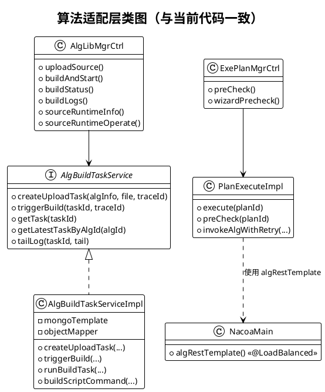
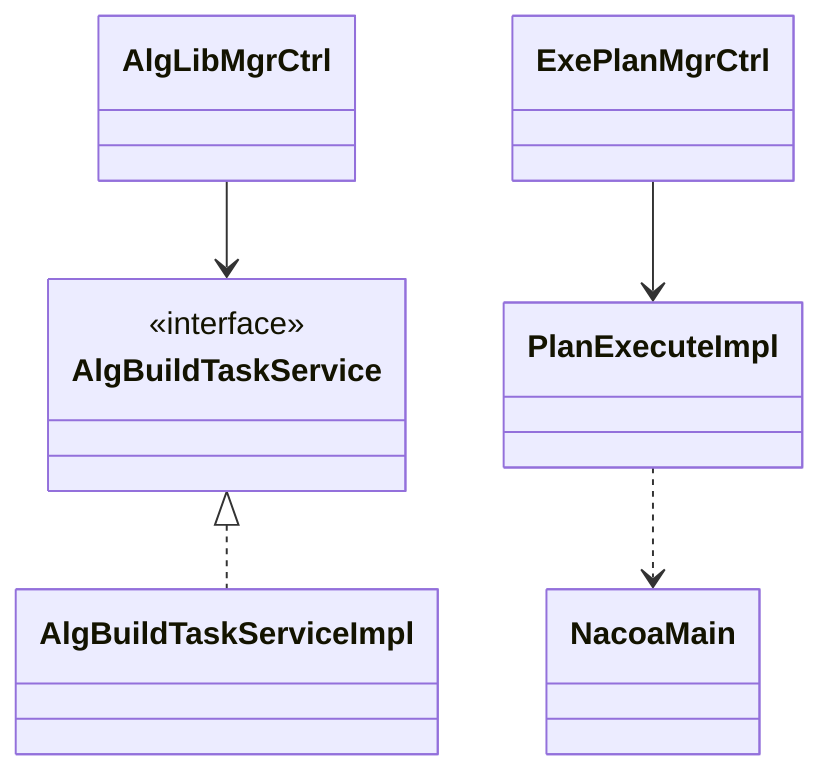

# 图10 算法适配层类图

## 图片依据

### 相关代码文件
- `exphlp/api/webApp/src/main/java/fjnu/edu/controller/AlgLibMgrCtrl.java`
- `exphlp/api/webApp/src/main/java/fjnu/edu/algruntime/service/AlgBuildTaskService.java`
- `exphlp/api/webApp/src/main/java/fjnu/edu/algruntime/service/impl/AlgBuildTaskServiceImpl.java`
- `exphlp/api/webApp/src/main/java/fjnu/edu/controller/ExePlanMgrCtrl.java`
- `exphlp/api/clientApi/src/main/java/fjnu/edu/impl/PlanExecuteImpl.java`
- `exphlp/api/clientApi/src/main/java/fjnu/edu/NacoaMain.java`

## 图表说明

当前项目中的“算法适配层”不是策略工厂模式，而是三段式适配：  
1. 构建适配：`AlgBuildTaskServiceImpl` 按 `runtimeType` 生成构建脚本与容器。  
2. 调用适配：`PlanExecuteImpl` + `@LoadBalanced RestTemplate` 按服务名调用 `/myAlg/`。  
3. 诊断适配：`ExePlanMgrCtrl.wizardPrecheck` 对实例可达性与 Python 健康接口进行检查。

## PlantUML代码

## Mermaid代码

