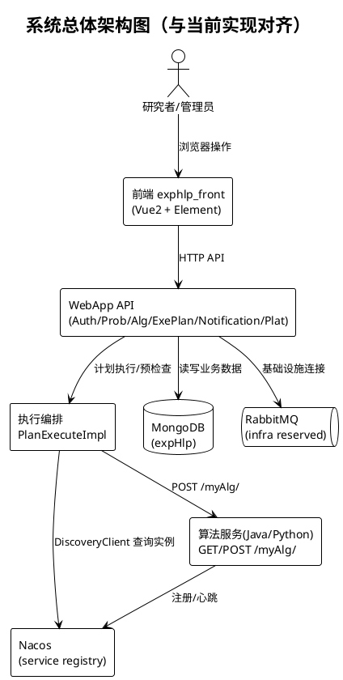
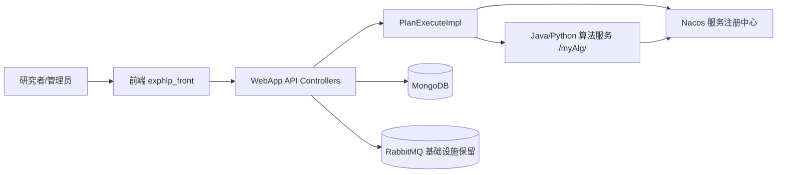

# 图1 系统总体架构图

## 图片依据

### 相关代码文件
- `docker/docker-compose.yml`
- `exphlp/api/webApp/src/main/java/fjnu/edu/controller/`
- `exphlp/api/clientApi/src/main/java/fjnu/edu/impl/PlanExecuteImpl.java`
- `exphlp-front/src/views/`

### 相关文档
- `docs/dev/维护手册.md`
- `docs/dev/Nacos功能与开发说明.md`
- `docs/user/快速上手-从部署到执行.md`

## 图表说明

本图展示当前项目的总体模块边界与关键交互。系统由前端、WebApp 控制层、领域编排层、基础设施层和算法服务层构成。  
前端通过 HTTP 调用 WebApp API；WebApp 在执行计划时通过 Nacos 按 `serviceName` 发现算法实例并调用 `/myAlg/`。  
MongoDB 承载计划、日志、结果、用户与通知等业务数据，RabbitMQ 当前作为基础设施保留（非执行主链路）。  
算法服务包含 Java 与 Python 两类实现，统一暴露 `/myAlg/` 协议接口。

## PlantUML代码

## Mermaid代码

