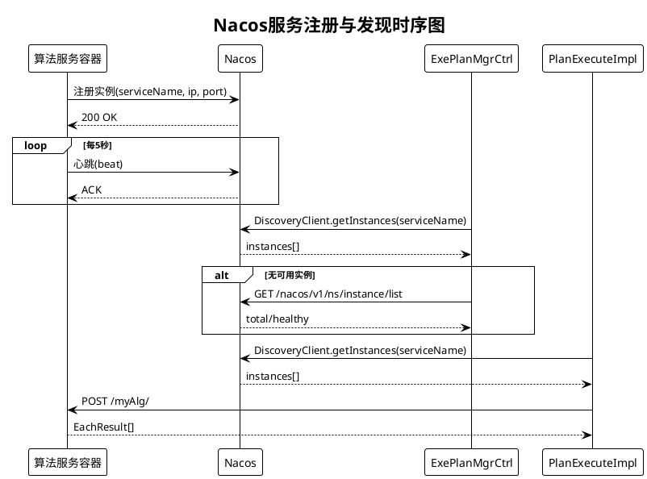
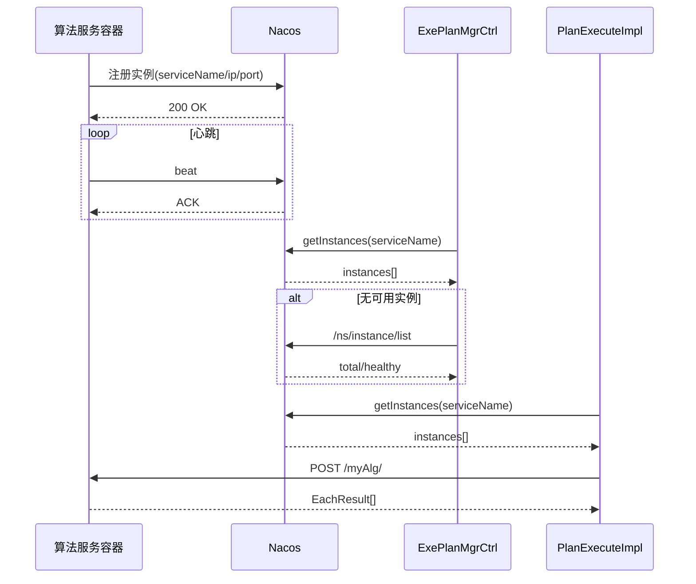

# 图2 Nacos服务注册与发现时序图

## 图片依据

### 相关代码文件
- `exphlp/api/clientApi/src/main/java/fjnu/edu/NacoaMain.java`
- `exphlp/api/clientApi/src/main/java/fjnu/edu/impl/PlanExecuteImpl.java`
- `exphlp/api/webApp/src/main/java/fjnu/edu/controller/ExePlanMgrCtrl.java`
- `scripts/tasks/build-uploaded-alg.sh`
- `scripts/tasks/build-uploaded-alg.ps1`

### 相关配置
- `docker/docker-compose.yml`（Nacos: 8848/9848/9849）

## 图表说明

本图描述真实实现中的 Nacos 时序：算法服务启动后注册实例并发送心跳；平台执行前通过 `DiscoveryClient` 查询实例；执行阶段按服务名调用算法接口。  
当 `DiscoveryClient` 无可用实例时，执行向导会回查 Nacos OpenAPI 以区分“未注册”与“实例不健康”。

## PlantUML代码

## Mermaid代码

