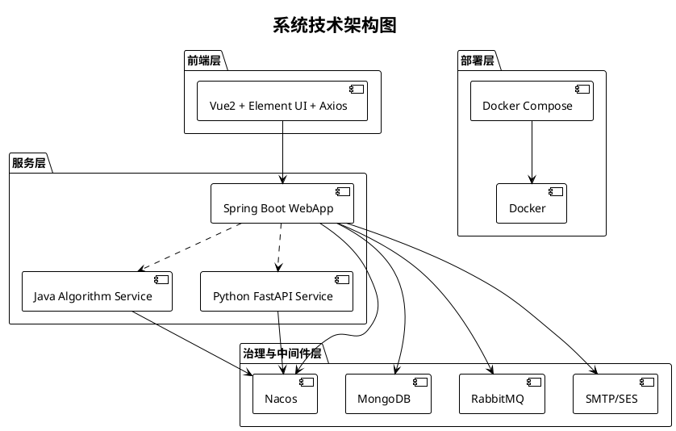
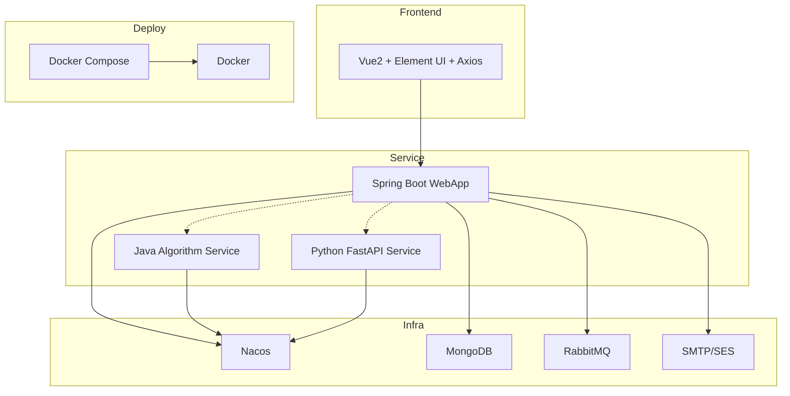

# 图3 系统技术架构图

## 图片依据

### 相关代码文件
- `exphlp-front/package.json`
- `exphlp/pom.xml`
- `exphlp/api/webApp/src/main/resources/application.yml`
- `docker/docker-compose.yml`
- `docs/templates/java-springboot-nacos/`
- `docs/templates/python-fastapi-nacos/`

## 图表说明

本图按当前仓库真实落地展示技术栈：  
- 前端层：Vue2 + Element UI + Axios  
- 后端层：Spring Boot 2.7.x + Spring Cloud Alibaba Nacos  
- 算法服务层：Java SpringBoot 或 Python FastAPI（统一 `/myAlg/` 接口）  
- 部署层：Docker + Docker Compose  
- 基础设施层：Nacos、MongoDB、RabbitMQ、SMTP/SES。

注：`NumPy/Geatpy/PlatEMO` 等属于具体算法案例可能依赖，不是平台固定全局依赖，不在主技术栈中强绑定。

## PlantUML代码

## Mermaid代码

