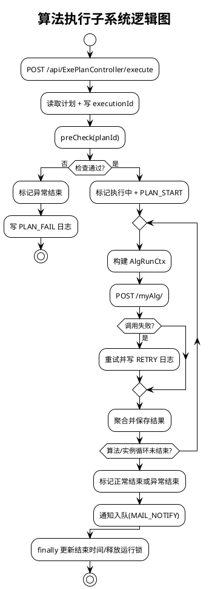
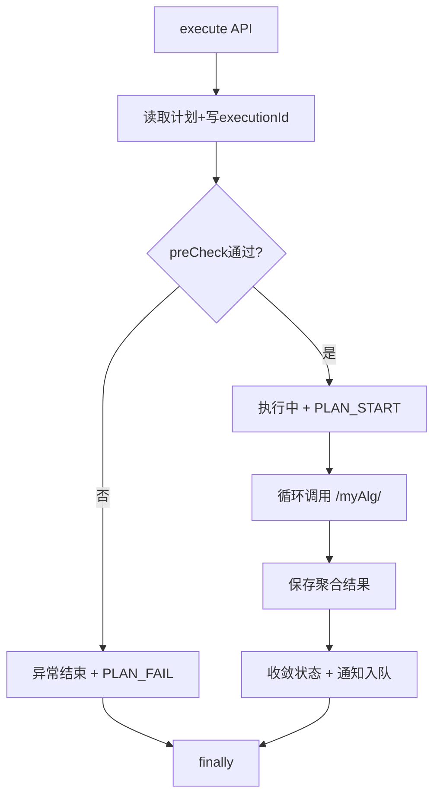

# 图5 算法执行子系统逻辑图

## 图片依据

### 相关代码文件
- `exphlp/api/clientApi/src/main/java/fjnu/edu/impl/PlanExecuteImpl.java`
- `exphlp/api/webApp/src/main/java/fjnu/edu/controller/ExePlanMgrCtrl.java`
- `exphlp/domain/exePlanMgr/src/main/java/fjnu/edu/exePlanMgr/dao/ExePlanMgrDao.java`
- `exphlp/api/clientApi/src/main/java/fjnu/edu/notify/service/impl/NotificationServiceImpl.java`

## 图表说明

本图描述执行子系统真实主流程：  
1. 控制器受理执行请求。  
2. 执行器读取计划并执行预检查。  
3. 通过后进入算法/问题实例循环调用 `/myAlg/`，失败重试并写日志。  
4. 成功或异常均会收敛执行状态并触发通知入队。  
5. `finally` 阶段写入结束时间并释放运行锁。

## PlantUML代码

## Mermaid代码

