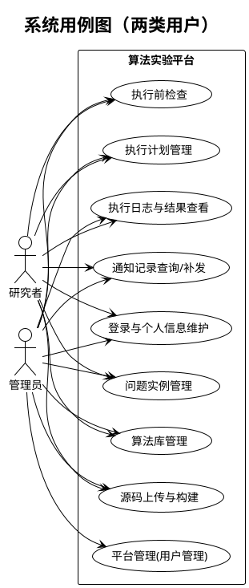
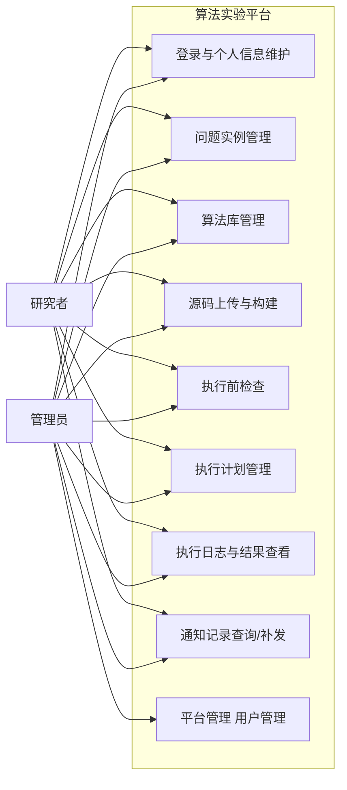

# 图6 系统用例图

## 图片依据

### 相关代码文件
- `exphlp-front/src/views/problemModel/index.vue`
- `exphlp-front/src/views/algorithm/algorithmConfig.vue`
- `exphlp-front/src/views/planManage/index.vue`
- `exphlp-front/src/views/platform/platformManage.vue`
- `exphlp/api/webApp/src/main/java/fjnu/edu/controller/ExePlanMgrCtrl.java`
- `exphlp/api/webApp/src/main/java/fjnu/edu/controller/PlatMgrCtrl.java`

### 相关文档
- `docs/user/快速上手-从部署到执行.md`
- `docs/dev/维护手册.md`

## 图表说明

本图仅包含当前项目真实存在的两类用户：`研究者`、`管理员`。  
研究者可完成问题实例、算法库、执行计划、执行日志与结果查看、个人信息和通知配置等实验流程。  
管理员具备平台账号管理与全局运维权限（新增/编辑/删除用户、重置密码等）。

## PlantUML代码

## Mermaid代码

