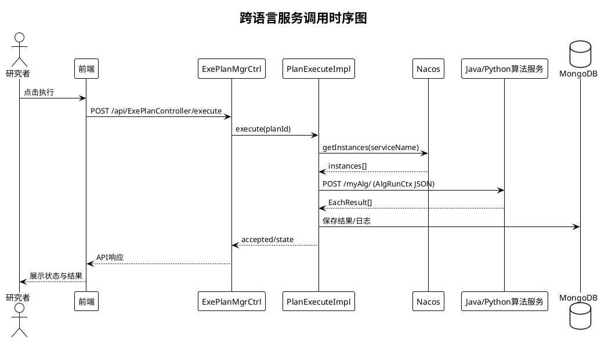
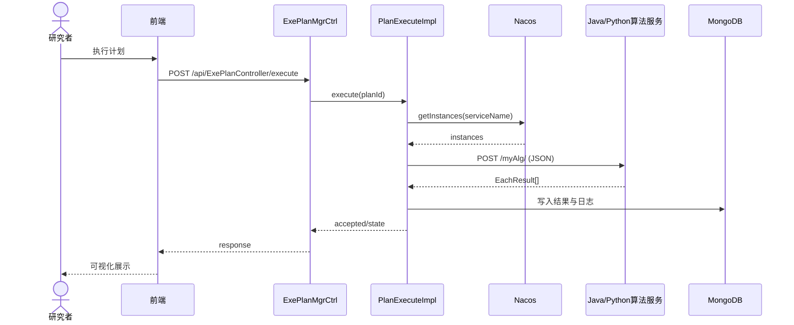

# 图7 跨语言服务调用时序图

## 图片依据

### 相关代码文件
- `exphlp/api/webApp/src/main/java/fjnu/edu/controller/ExePlanMgrCtrl.java`
- `exphlp/api/clientApi/src/main/java/fjnu/edu/impl/PlanExecuteImpl.java`
- `exphlp/api/clientApi/src/main/java/fjnu/edu/NacoaMain.java`
- `docs/templates/python-fastapi-nacos/main.py`
- `scripts/tasks/build-uploaded-alg.sh`

## 图表说明

本图展示真实跨语言执行链路：  
前端触发执行 -> WebApp 受理 -> 执行器通过 Nacos 发现实例 -> `POST /myAlg/` 调用 Java/Python 算法服务 -> 返回 `EachResult[]` -> 平台持久化。  
协议层统一为 `HTTP + JSON`，并通过统一端点实现语言无关调用。

## PlantUML代码

## Mermaid代码

