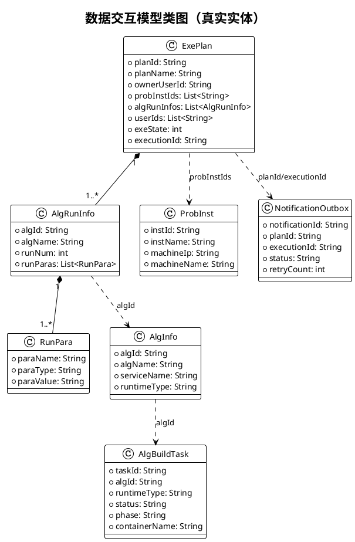
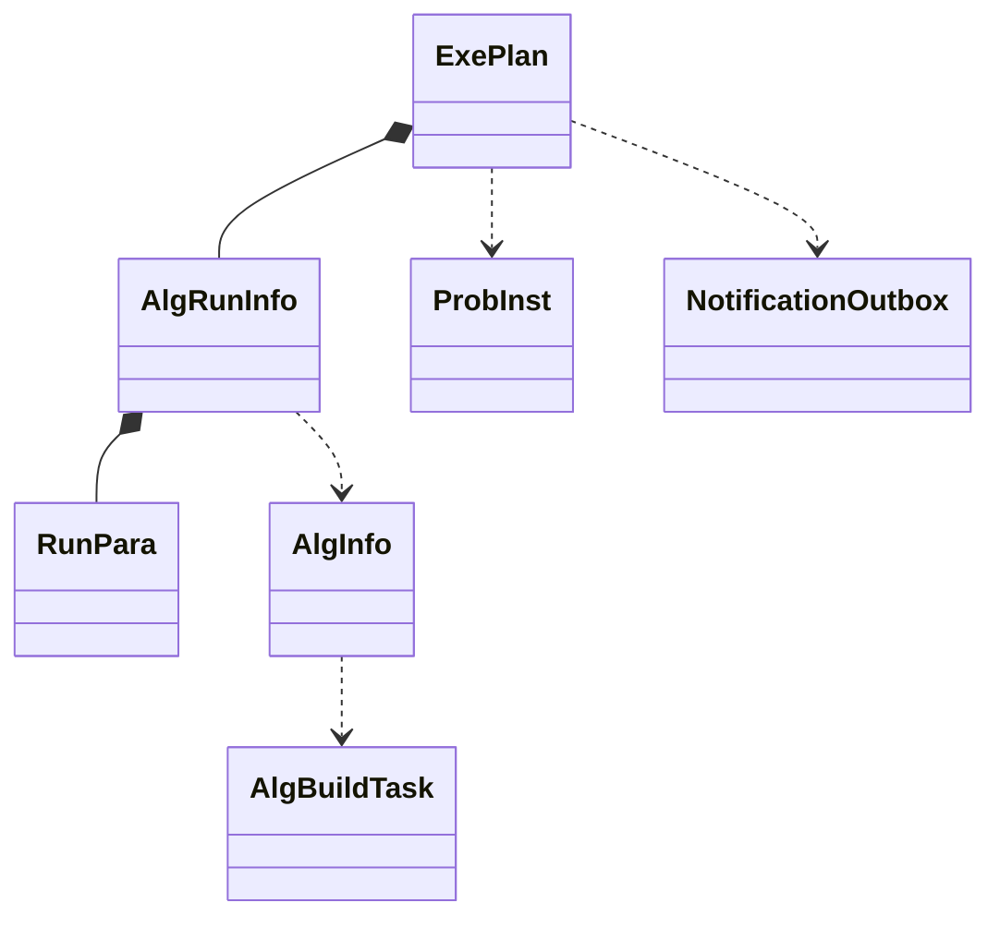

# 图8 数据交互模型类图

## 图片依据

### 相关代码文件
- `exphlp/domain/exePlanMgr/src/main/java/fjnu/edu/exePlanMgr/entity/ExePlan.java`
- `exphlp/domain/exePlanMgr/src/main/java/fjnu/edu/exePlanMgr/entity/AlgRunInfo.java`
- `exphlp/domain/exePlanMgr/src/main/java/fjnu/edu/exePlanMgr/entity/RunPara.java`
- `exphlp/domain/probInstMgr/src/main/java/fjnu/edu/probInstMgr/entity/ProbInst.java`
- `exphlp/domain/algLibMgr/src/main/java/fjnu/edu/alglibmgr/entity/AlgInfo.java`
- `exphlp/api/clientApi/src/main/java/fjnu/edu/notify/entity/NotificationOutbox.java`
- `exphlp/api/webApp/src/main/java/fjnu/edu/algruntime/entity/AlgBuildTask.java`

## 图表说明

本图基于真实实体类展示关键数据对象：执行计划、算法运行配置、问题实例、算法信息、通知任务和构建任务。  
关系以“聚合与 ID 引用”为主，不引入项目中不存在的抽象基类或统一结果对象。

## PlantUML代码

## Mermaid代码

