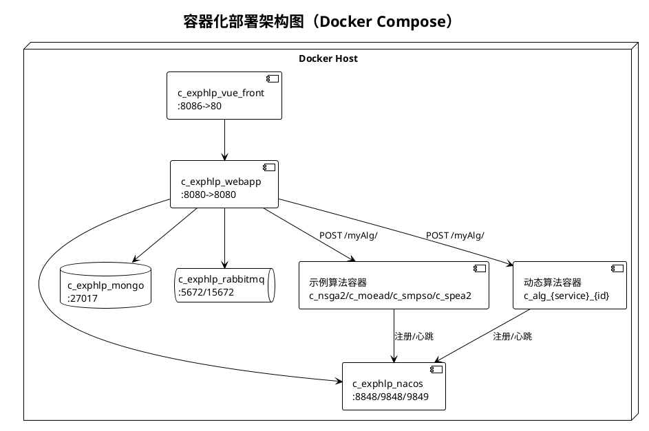
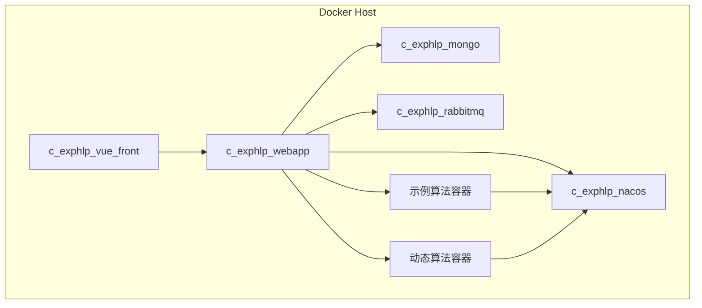

# 图9 容器化部署架构图

## 图片依据

### 相关代码文件
- `docker/docker-compose.yml`
- `docker/webapp/Dockerfile`
- `docker/frontend/Dockerfile`
- `docker/alg-runner/Dockerfile`
- `scripts/ops.ps1`
- `scripts/tasks/check-runtime-readiness.ps1`

## 图表说明

本图基于 `docker-compose.yml` 真实服务定义：  
核心容器包括 `c_exphlp_vue_front`、`c_exphlp_webapp`、`c_exphlp_nacos`、`c_exphlp_mongo`、`c_exphlp_rabbitmq`。  
算法容器包括固定示例容器和源码上传后动态构建容器。  
WebApp 通过 Docker Socket 执行构建/启动/下线等运维动作，并通过 Nacos 发现算法服务实例。

## PlantUML代码

## Mermaid代码

